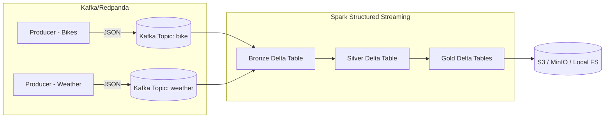

# 🚲🌦 City Mobility Pulse – Real-Time Streaming ETL with Spark, Delta Lake & Kafka

## 📖 Overview
**City Mobility Pulse** is a real-time data pipeline that simulates and processes **bike-sharing** and **weather events**.  

The pipeline ingests data from Kafka (via Redpanda), applies streaming transformations in **Apache Spark**, and stores results in a **Delta Lake** using the **Bronze → Silver → Gold architecture**.

This project is useful for:
- Learning **modern streaming ETL pipelines**
- Understanding how **weather impacts bike-sharing usage**
- Building a foundation for **real-time analytics dashboards**

---

## 🏗 Architecture



- **Producers** generate fake bike & weather events and push to Kafka/Redpanda.  
- **Spark** reads from Kafka, processes events, and writes into Delta Lake tables.  
- **Delta Lake** stores results in **Bronze, Silver, and Gold layers**.  

---

## ⚙️ Tech Stack

- **Apache Spark (Structured Streaming)** – real-time ETL  
- **Delta Lake** – ACID-compliant data storage  
- **Kafka / Redpanda** – event streaming backbone  
- **Python 3.11** – main driver language  
- **Docker & Docker Compose** – local containerized setup  
- **Makefile** – helper commands for local dev  
- **Linters** – black, flake8, pylint, isort for code quality  

---

## 📂 Project Layout

```
repo-root/
│
├── app/
│   ├── api/                  # FastAPI-based service (if running API)
│   └── streaming/
│       └── stream_to_delta.py   # Main Spark job
│
├── producers/                # Data producers (bike & weather)
│   ├── producer_bike.py
│   └── producer_weather.py
│
├── common/                   # Shared modules/config
│   └── conf.py
│
├── requirements.txt          # Python deps
├── pyproject.toml            # Linting/formatting config
├── Dockerfile                # Container build
├── docker-compose.yml        # Local services (Kafka/Redpanda, Spark)
└── Makefile                  # Helper commands
```

---

## 🚀 Getting Started

### 1. Prerequisites
Install these locally:
- [Docker](https://docs.docker.com/get-docker/)
- [Docker Compose](https://docs.docker.com/compose/install/)
- Python 3.11 (optional, if running outside Docker)
- GNU Make (`make`) for helper commands

---

### 2. Clone Repo
```bash
git clone https://github.com/<your-org>/<your-repo>.git
cd <your-repo>
```

---

### 3. Setup Environment
Copy `.env.example` to `.env` and adjust values if needed:

```bash
cp .env.example .env
```

By default:
- **BROKER** → `redpanda:9092`
- **KAFKA_TOPIC_BIKE** → `bike`
- **KAFKA_TOPIC_WEATHER** → `weather`
- **S3/MinIO endpoint** → configured in `conf.py`

---

### 4. Run Services (Kafka + Spark + Producers)
Start everything using Docker Compose:

```bash
make up
```

This will:
- Spin up Redpanda (Kafka replacement)  
- Start Spark container  
- Run producers for bike & weather  

---

### 5. Run Spark Streaming Job
Inside container:

```bash
make spark
```

This runs:
```bash
spark-submit   --packages org.apache.spark:spark-sql-kafka-0-10_2.12:3.5.1,org.apache.spark:spark-token-provider-kafka-0-10_2.12:3.5.1   app/streaming/stream_to_delta.py
```

---

### 6. Inspect Output
- **Bronze Tables** – `s3a://lakehouse/bronze/{bike,weather}`  
- **Silver Tables** – `s3a://lakehouse/silver/{bike_events,weather_events}`  
- **Gold Tables** – `s3a://lakehouse/gold/{bike_usage_hourly, bike_usage_daily, weather_hourly, weather_daily}`  

You can query them via Spark SQL or open them in a Delta-compatible tool.

---

## 🧑‍💻 Development & Code Quality

We enforce consistent Python style via **pyproject.toml**.

### Format Code
```bash
make fmt
```

### Lint Code
```bash
make lint
```

### Run All Checks
```bash
make check
```

This runs:
- **Black** (formatter)  
- **Flake8** (PEP8 compliance)  
- **Pylint** (static analysis)  
- **Isort** (import ordering)  

---

## 📝 Example Queries

Once tables are built, you can query things like:

- 🚲 *Hourly bike utilization by station:*  
```sql
SELECT station_id, hour(event_time) AS hr, avg(utilization_rate)
FROM gold.bike_usage_hourly
GROUP BY station_id, hr;
```

- 🌦 *Correlation between rainfall & bike usage:*  
```sql
SELECT w.precip_mm, b.total_bikes
FROM gold.weather_hourly w
JOIN gold.bike_usage_hourly b
  ON w.hour = b.hour AND w.station_id = b.station_id;
```

---

## 🔮 Future Improvements
- Add schema registry validation  
- Deploy to Kubernetes  
- Add Grafana/Prometheus monitoring  
- REST API for querying aggregates  

---

## 🤝 Contributing
PRs welcome! Run `make check` before pushing.

---

## 📜 License
MIT License
