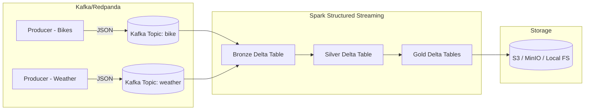

# 🚲🌦 City Mobility Pulse – Real-Time Streaming ETL with Spark, Delta Lake & Kafka

## 📖 Overview
**City Mobility Pulse** is a personal project that demonstrates a modern **data streaming and lakehouse architecture** using open-source tools. It simulates **real-world streaming pipelines** by generating fake data for **bike rentals** and **weather conditions**, then ingesting, processing, and storing that data into a Delta Lake for further analysis. 

To make the simulation realistic, the project uses a set of **cities in the Boston area (Massachusetts, USA)** as the base for the streaming data. Weather baselines and bike stations are mapped to these cities so the data mimics real-world conditions — noisy, varied, and changing over time.

The pipeline ingests data from Kafka (via Redpanda), applies streaming transformations in **Apache Spark**, and stores results in a **Delta Lake** using the **Bronze → Silver → Gold architecture**.

This project is useful for:
- Learning **modern streaming ETL pipelines**
- Understanding how **weather impacts bike-sharing usage**
- Building a foundation for **real-time analytics dashboards**

---

## 🏗 Architecture



- **Producers** generate fake bike & weather events and push to Kafka/Redpanda.  
- **Spark** reads from Kafka, processes events, and writes into Delta Lake tables.  
- **Delta Lake** stores results in **Bronze, Silver, and Gold layers**.  

## Bronze, Silver, and Gold Tables (Medallion Architecture)

This project follows the **Medallion Architecture** pattern in Delta Lake, which organizes data into three layers  **Bronze**, **Silver**, and **Gold**  to mimic real-world data engineering practices.

### 🥉 Bronze Layer (Raw Data)
- **Purpose**: Stores raw, unprocessed data exactly as it arrives from the source (in this case, Kafka topics for bikes and weather).
- **Details**: Includes Kafka metadata (topic, partition, offset, timestamp) alongside the event payload.
- **Benefit**: Acts as a secure *landing zone*. Nothing is lost, and data lineage remains traceable to its original source.

### 🥈 Silver Layer (Cleaned & Enriched Data)
- **Purpose**: Transforms Bronze data into a cleaner, structured format by parsing JSON, casting types, and ensuring correct timestamps.
- **Details**: Invalid or malformed records are filtered out, and useful helper columns (e.g., availability/utilization rates for bikes) are derived.
- **Benefit**: Provides a reliable foundation for analytics and ensures that downstream consumers don’t have to re-clean raw data.

### 🥇 Gold Layer (Aggregated & Business-Ready Data)
- **Purpose**: Aggregates Silver data into meaningful insights (e.g., bike usage hourly/daily trends, weather summaries).
- **Details**: 
  - **Bike Gold**: hourly, daily, and minute-level usage statistics.  
  - **Weather Gold**: hourly and daily climate summaries.  
- **Benefit**: Optimized for consumption by BI dashboards, data scientists, or machine learning pipelines. This is the layer stakeholders interact with most directly.

### 🔄 Real-World Mimicry
This layering mirrors how real companies manage data:
- **Bronze** = “data lake dump” (raw logs, events, or API dumps).  
- **Silver** = cleaned and standardized data, consistent across the organization.  
- **Gold** = curated datasets used by analysts and decision-makers.  

By following this design, the pipeline ensures:
- Data quality improves step by step.  
- Each layer is reproducible and fault-tolerant.  
- Teams can collaborate: data engineers focus on Bronze/Silver, analysts and BI teams consume Gold.  
---

## ⚙️ Tech Stack

- **Apache Spark (Structured Streaming)** – real-time ETL  
- **Delta Lake** – ACID-compliant data storage  
- **Kafka / Redpanda** – event streaming backbone  
- **Python 3.11** – main driver language  
- **Docker & Docker Compose** – local containerized setup  
- **Makefile** – helper commands for local dev  
- **Linters** – black, flake8, pylint, isort for code quality  

---

## 📂 Project Layout
## Project Layout

Below is the repository structure (folders you’ll see after cloning).  
I’ve added short, human-readable notes next to each folder/file so anyone can skim
and understand what lives where.


```bash
city-mobility-pulse/
├── .env.example
├── README.md
├── Makefile
├── logs/
│   └── YYYY-MM-DD/
│       └── spark-stream.YYYY-MM-DD_HH-MM-SS.log
│
├── infra/
│   └── compose/
│       ├── docker-compose.yml
│       └── (optional) .env
│
├── app/
│   ├── api/
│   │   ├── Dockerfile
│   │   ├── requirements.txt
│   │   └── main.py
│   │
│   ├── web/
│   │   ├── Dockerfile
│   │   ├── index.html
│   │   ├── src/
│   │   │   ├── main.jsx
│   │   │   └── App.jsx
│   │   ├── package.json
│   │   └── vite.config.js
│   │
│   └── common/
│       └── settings.py
│
├── pipelines/
│   ├── producers/
│   │   ├── Dockerfile
│   │   ├── producer_bike.py
│   │   └── producer_weather.py
│   │
│   └── spark/
│       ├── Dockerfile
│       ├── streaming/
│       │   ├── conf.py
│       │   └── stream_to_delta.py
│       └── (jars/)
│
└── .gitignore

```

### What each top-level piece does

- **Makefile**
  - `make up` / `make down` / `make restart` ; bring the stack up/down quickly.
  - `make spark-stream` ; submits the Spark job and writes logs under `./logs/<date>/`.
  - `make ui-start` (if you keep the web dev flow locally) or rely on the Dockerized web service.
  - Feel free to add your own shortcuts; the repo already uses the “dated log file” pattern.

- **infra/compose/docker-compose.yml**
  - Starts **Redpanda (Kafka)**, **MinIO (S3)**, **Spark**, **FastAPI**, and the **Web UI**.
  - Uses an **`x-common: &with-env`** anchor so **every** service sees the same `.env` values.
  - The `create-bucket` helper waits for MinIO and ensures the `S3_BUCKET` exists.
  - Ports you’ll care about:
    - Redpanda outside: `9094`
    - MinIO API/Console: `9000 / 9001`
    - FastAPI: `${API_PORT}` (default `8080`)
    - Web (Vite): `${WEB_PORT}` (default `5173`)

- **app/api**
  - **main.py** exposes endpoints:
    - `/silver/bike`, `/silver/weather`: reads parsed/cleaned **Silver** tables.
    - `/gold/bike_minute`, `/gold/bike_hourly`, `/gold/weather_hourly`: reads **Gold** aggregates.
  - Uses the `deltalake` Python lib to open Delta tables **stored in MinIO** via S3 options from env.
  - CORS is enabled for dev ports (5173/5174).

- **app/web**
  - Minimal front-end to “see something now.” Calls FastAPI and renders JSON results.
  - Useful as a sanity check while data accrues in Silver/Gold.
  - Runs via Docker (or `npm run dev` if you prefer local).

- **pipelines/producers**
  - Two Python scripts publishing JSON events into Kafka:
    - **producer_bike.py**: contains a fixed station map (S001–S030) and realistic station metrics.
    - **producer_weather.py**: emits weather for the **same** stations, so you can join later.
  - Both use **confluent-kafka**; they respect interval and broker/topic env vars.

- **pipelines/spark/streaming**
  - **stream_to_delta.py** implements the **Medallion (Bronze/Silver/Gold)** flow:
    - **Bronze** → raw JSON + Kafka metadata (partition/offset/timestamp).
    - **Silver** → parsed schemas, typed timestamps, derived metrics, watermarks.
    - **Gold** → per-station minute/hour/day aggregates for bike & weather.
  - **conf.py** holds Spark/Delta/S3A config (endpoint, credentials, path-style, etc.).
  - Output layout in MinIO:
    - `s3a://<bucket>/bronze/*`
    - `s3a://<bucket>/silver/bike_events`, `.../silver/weather_events`
    - `s3a://<bucket>/gold/bike_minute`, `.../gold/bike_usage_hourly`, `.../gold/weather_hourly`, etc.

- **app/common/settings.py** (optional helper)
  - A small Pydantic-Settings based module to centralize env reading, if you want to reduce
    repeated `os.getenv` calls. Not required for the current working code, but handy if you refactor.

- **logs/**
  - Spark logs land here automatically when you run `make spark-stream`.  
    Each invocation creates a **date directory** and a **timestamped log file**.

---

### Where to put new files

- **New Python services** → under `app/<service-name>/` with its own `Dockerfile/requirements.txt`.
- **More producers** → `pipelines/producers/` (reuse the same Dockerfile).
- **Extra Spark jobs** → `pipelines/spark/<new-job>/` or beside `streaming/` if it’s part of the same app.

---

### Environment variables (quick reference)

Defined in your `.env` (you can copy from `.env.example`):

- **MinIO / S3**
  - `S3_ENDPOINT=http://minio:9000`
  - `S3_BUCKET=lakehouse`
  - `AWS_ACCESS_KEY_ID=...`
  - `AWS_SECRET_ACCESS_KEY=...`

- **Kafka / Redpanda**
  - `REDPANDA_BROKERS=redpanda:9092`
  - `KAFKA_TOPIC_BIKE=bike`
  - `KAFKA_TOPIC_WEATHER=weather`

- **API / Web**
  - `API_PORT=8080`
  - `WEB_PORT=5173`

- **Postgres (optional for later)**
  - `POSTGRES_USER=postgres`
  - `POSTGRES_PASSWORD=postgres`
  - `POSTGRES_DB=mobility`

- **MLflow (optional)**
  - `MLFLOW_TRACKING_URI=http://mlflow:5050`

> Thanks to the compose **anchor** (`x-common: &with-env`), these vars are injected into **every** service automatically. <

---


---

## 🚀 Getting Started

### 1. Prerequisites
Install these locally:
- [Docker](https://docs.docker.com/get-docker/)
- [Docker Compose](https://docs.docker.com/compose/install/)
- Python 3.11 (optional, if running outside Docker)
- GNU Make (`make`) for helper commands

---

### 2. Clone Repo
```bash
git clone https://github.com/airdmhund1/city-mobility-pulse.git
cd city-mobility-pulse
```

---

### 3. Setup Environment
Copy `.env.example` to `.env` and adjust values if needed:

```bash
cp .env.example .env
```

By default:
- **BROKER** → `redpanda:9092`
- **KAFKA_TOPIC_BIKE** → `bike`
- **KAFKA_TOPIC_WEATHER** → `weather`
- **S3/MinIO endpoint** → configured in `conf.py`

---

### 4. Run Services (Kafka + Spark + Producers) *from root of project8
Start everything using Docker Compose:

```bash
make up
```

This will:
- Spin up Redpanda (Kafka replacement)  
- Start Spark container  
- Run producers for bike & weather  

---

### 5. Run Spark Streaming Job
From root of Repo (or from):

```bash
make spark-stream
```

This runs:
```bash
spark-submit   --packages org.apache.spark:spark-sql-kafka-0-10_2.12:3.5.1,org.apache.spark:spark-token-provider-kafka-0-10_2.12:3.5.1   app/streaming/stream_to_delta.py
```

---

### 6. Inspect Output
- **Bronze Tables** – `s3a://lakehouse/bronze/{bike,weather}`  
- **Silver Tables** – `s3a://lakehouse/silver/{bike_events,weather_events}`  
- **Gold Tables** – `s3a://lakehouse/gold/{bike_usage_hourly, bike_usage_daily, weather_hourly, weather_daily}`  

You can query them via Spark SQL or open them in a Delta-compatible tool.

---

## 🧑‍💻 Development & Code Quality

We enforce consistent Python style via **pyproject.toml**.

### Format Code
```bash
make fmt
```

### Lint Code
```bash
make lint
```

### Run All Checks
```bash
make check
```

This runs:
- **Black** (formatter)  
- **Flake8** (PEP8 compliance)  
- **Pylint** (static analysis)  
- **Isort** (import ordering)  
** should have installed the following
```bash
pip install black isort flake8 mypy pylint
```

---

## 📝 Example Queries

Once tables are built, you can query things like:

- 🚲 *Hourly bike utilization by station:*  
```sql
SELECT station_id, hour(event_time) AS hr, avg(utilization_rate)
FROM gold.bike_usage_hourly
GROUP BY station_id, hr;
```

- 🌦 *Correlation between rainfall & bike usage:*  
```sql
SELECT w.precip_mm, b.total_bikes
FROM gold.weather_hourly w
JOIN gold.bike_usage_hourly b
  ON w.hour = b.hour AND w.station_id = b.station_id;
```

---

## 🔮 Future Improvements
- Add schema registry validation  
- Deploy to Kubernetes  
- Add Grafana/Prometheus monitoring  
- REST API for querying aggregates  

---

## 🤝 Contributing
PRs welcome! Run `make check` before pushing.

---

## 📜 License
MIT License
